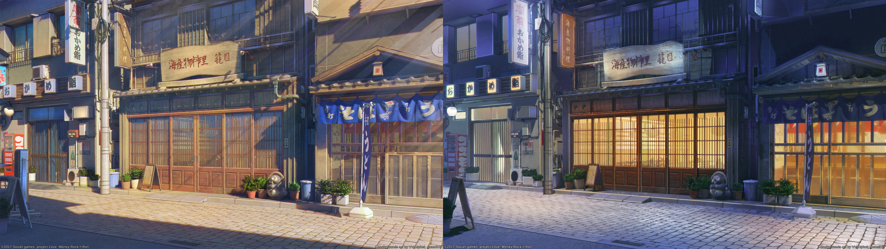
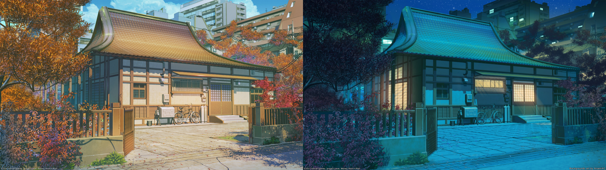

# Collection of Dynamic wallpapers for KDE 

## How-to
wallpapers presented in AVIF format to work with [zzag's Plasma Dynamic Wallpapers plugin](https://github.com/zzag/plasma5-wallpapers-dynamic). You'll need to install it first and set your location; then, download a wallpaper and add it from wallpaper settings.
*All rights to wallpapers belong to their owners and creators*
- [Mojave] (Wallpapers/Mojave.avif)
    - 
    - Artist: Apple inc.
    - Size: 5120×2880
    - Type: Solar
 
- [Fuji] (Wallpapers/Fuji.avif)
    - 
    - Artist: Max Kulakov (https://t.me/maxkulakov)
    - Size: 5719x3720
    - Type: Solar

- [Big Sur Graphic] (Wallpapers/BigSurGraphic.avif)
    -
    - Artist: Apple inc.
    - Size: 6016x6016
    - Type: Solar
    
- [Big Sur] (Wallpapers/Big Sur.avif)
    -
    - Artist: Apple inc.
    - Size: 6016x6016
    - Type: Solar
    
- [Pangong Tso] (Wallpapers/Pangong-Tso.avif)
    -
    - Artist: Bhumil (https://bhumil.com/)
    - Size: 5519x3104
    - Type: Solar
    
- [Restaurant] (Wallpapers/Restaurant.avif)
    -
    - Artist: Copycatken (https://dynamicwallpaper.club/u/Copycatken)
    - Size: 1920×1080
    - Type: Solar

- [House] (Wallpapers/House.avif)
    -
    - Artist: Copycatken (https://dynamicwallpaper.club/u/Copycatken)
    - Size: 1920×1080
    - Type: Solar    
